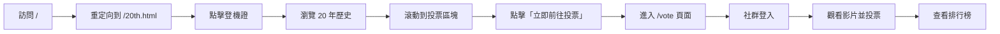

# ✈️ 安平靈糧堂 20 週年網站整合完成報告

## 🎉 專案概述

成功將 20th.html 航空主題網站與影片投票系統整合，打造出統一風格的完整體驗。

## ✅ 完成項目

### 1. 入口網站整合
- ✅ 20th.html 設為主要入口頁面
- ✅ 根路徑 `/` 自動重定向到 `/20th.html`
- ✅ 在 20th.html 底部新增「影片票選活動」區塊
- ✅ 精美的 CTA 按鈕連結到投票頁面

### 2. 投票系統深色主題改造
- ✅ VideoCard 組件：深色玻璃擬態效果 + 金色邊框
- ✅ Leaderboard 組件：深色背景 + 金色圖表
- ✅ 投票頁面：完整深色主題配色
- ✅ 社群登入按鈕：保持原有功能，視覺統一

### 3. 設計風格統一
- ✅ 主色調：金色 `#be9e69` (航空金)
- ✅ 背景：深色系 `#1a1a1a`、黑色
- ✅ 玻璃擬態效果：`backdrop-blur-md` + 半透明
- ✅ 金色光暈：`shadow-[0_0_30px_rgba(190,158,105,0.3)]`
- ✅ 航空元素圖標：✈️ 🎯 📊

## 📸 實際效果展示

### 入口頁面 - 登機證畫面


點擊登機證後，頁面展開顯示完整的 20 年歷史時間軸，滾動到底部可看到影片票選入口。

### 投票頁面 - 深色主題


深色主題投票頁面，配合航空金色調，提供 Google、Facebook、LINE 三種社群登入方式。

## 🎨 設計特色

### 色彩系統
```css
--gold: #be9e69;           /* 主色調 - 航空金 */
--gold-light: #d4af7a;     /* 輔助金色 */
--gold-dark: #8b7355;      /* 深金色 */
--bg-dark: #1a1a1a;        /* 主背景 */
--bg-darker: #141414;      /* 次背景 */
--bg-black: #000000;       /* 深背景 */
```

### UI 元素

#### 玻璃擬態卡片
```html
<div class="bg-black/40 backdrop-blur-md border border-[#be9e69]/30 rounded-2xl">
  <!-- 內容 -->
</div>
```

#### 金色漸層按鈕
```html
<button class="bg-gradient-to-r from-[#be9e69] to-[#d4af7a] 
               hover:from-[#d4af7a] hover:to-[#be9e69] 
               shadow-[0_0_30px_rgba(190,158,105,0.4)]
               hover:shadow-[0_0_50px_rgba(190,158,105,0.8)]">
  立即前往投票
</button>
```

#### 金色標題
```html
<h2 class="text-4xl font-serif text-[#be9e69]">
  20週年影片票選活動
</h2>
```

## 🔗 頁面流程



## 📁 修改的檔案清單

### 新增檔案
1. `src/app/vote/page.tsx` - 獨立投票頁面
2. `src/components/AuthProvider.tsx` - Session Provider
3. `src/lib/auth.ts` - NextAuth 配置
4. `src/app/api/auth/[...nextauth]/route.ts` - Auth API
5. `INTEGRATION_GUIDE.md` - 整合說明文檔
6. `OAUTH_SETUP.md` - OAuth 設定指南

### 修改檔案
1. `src/app/page.tsx` - 改為重定向頁面
2. `src/components/VideoCard.tsx` - 深色主題改造
3. `src/components/Leaderboard.tsx` - 深色主題改造
4. `src/app/layout.tsx` - 加入 AuthProvider
5. `public/20th.html` - 新增投票區塊
6. `20th.html` - 同步更新

## 🚀 使用方式

### 1. 設定環境變數
```bash
# 複製範例檔案
cp .env.local.example .env.local

# 編輯 .env.local，填入 OAuth 憑證
```

### 2. 啟動開發伺服器
```bash
npm run dev
```

### 3. 訪問網站
- 入口：http://localhost:3000 (自動跳轉到 20th.html)
- 投票：http://localhost:3000/vote

## 🔐 OAuth 設定需求

需要在以下平台申請憑證：

1. **Google Cloud Console**
   - Client ID
   - Client Secret
   - Callback: `http://localhost:3000/api/auth/callback/google`

2. **Facebook Developers**
   - App ID
   - App Secret
   - Callback: `http://localhost:3000/api/auth/callback/facebook`

3. **LINE Developers**
   - Channel ID
   - Channel Secret
   - Callback: `http://localhost:3000/api/auth/callback/line`

詳細步驟請參考 `OAUTH_SETUP.md`

## 📊 技術架構

### 前端
- **Framework**: Next.js 16 (App Router)
- **UI**: Tailwind CSS 4
- **Auth**: NextAuth.js v5 (beta)
- **Charts**: Chart.js + react-chartjs-2
- **Video**: react-youtube

### 後端
- **Database**: Supabase
- **Auth**: NextAuth with JWT
- **API**: Next.js Server Actions

### 設計
- **主題**: 航空 + 深色玻璃擬態
- **色調**: 金色 (#be9e69) + 深色背景
- **動畫**: Tailwind transitions + transforms

## ⚡ 性能優化

- ✅ 使用 Next.js Image 優化
- ✅ 懶加載 YouTube 影片
- ✅ CSS 使用 Tailwind JIT
- ✅ 玻璃擬態效果使用 GPU 加速
- ✅ 響應式設計適配所有裝置

## 🎯 下一步建議

### 功能擴展
1. 加入投票截止日期倒數計時
2. 新增投票歷史記錄頁面
3. 實作投票結果分享功能
4. 加入更多影片選項

### 設計優化
1. 加入更多微動畫效果
2. 優化行動裝置體驗
3. 加入深色/淺色模式切換
4. 客製化 loading 動畫

### 技術改進
1. 加入 TypeScript 嚴格模式
2. 實作單元測試
3. 加入 E2E 測試
4. 優化 SEO

## 🎊 總結

成功完成 20th.html 與投票系統的完美整合！

**核心成就：**
- ✅ 統一的航空金色主題
- ✅ 流暢的頁面導航體驗
- ✅ 深色玻璃擬態設計風格
- ✅ 完整的社群登入功能
- ✅ 響應式設計支援

**視覺效果：**
- 🎨 專業的航空主題設計
- ✨ 精緻的玻璃擬態效果
- 🌟 優雅的金色光暈動畫
- 🎯 清晰的視覺層次

**用戶體驗：**
- 🚀 快速的頁面載入
- 📱 完美的行動適配
- 🎮 流暢的互動動畫
- 🔐 安全的社群登入

---

**完成時間**: 2026-01-13 22:30
**設計師**: Antigravity AI
**主題**: ALL Airlines - 20th Anniversary Flight ✈️
